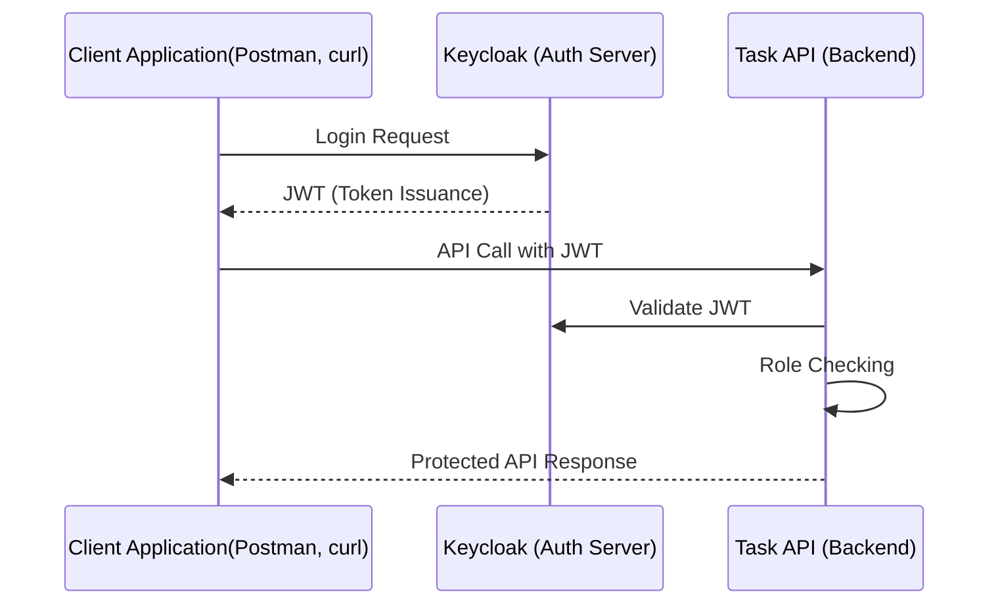

# Keycloak Authentication

This directory contains the Keycloak authentication infrastructure for the Cloud Native Gauntlet project.

## Overview

The authentication system uses Keycloak as the identity and access management provider, integrated with the Task API through JWT tokens and role-based access control.

## Architecture



## Components

### Keycloak Server
- **Identity Provider**: User authentication and token issuance
- **Role Management**: Admin and User role definitions
- **Client Configuration**: OAuth2/OpenID Connect client for Task API
- **Admin Console**: Web interface for user and realm management

### Task API Integration
- **JWT Validation**: Automatic token verification using axum-keycloak-auth
- **Role-Based Access**: Different endpoints require different roles
- **UUID Handling**: Proper user ID conversion from JWT claims


## Quick Setup

### 1. Deploy Keycloak
Refere to [apps readme](../README.md)

### 2. Access Keycloak Admin

```bash
# Add to /etc/hosts
echo "<MASTER_IP> keycloak.local" | sudo tee -a /etc/hosts

# Access admin console
open http://keycloak.local/admin
# Username: admin, Password: admin
```

### 3. Configure Realm and Client

1. **Create Realm**: Create a new realm (e.g., `task-realm`)
2. **Create Client**: Create a client ID for the Task API
3. **Set Roles**: Configure `admin` and `user` roles
4. **Create Users**: Add test users with appropriate roles

# Authentication

## Password Grant Flow (Resource Owner Password Credentials)

This method allows a client (such as our API) to directly exchange a username and password for an access token.  
It is simple but not recommended for production except for trusted clients (like back-end services).

### Request
```http
POST {keycloak-server}/realms/{realm-name}/protocol/openid-connect/token
Content-Type: application/x-www-form-urlencoded

grant_type=password
&client_id={client_id}
&client_secret={client-secret}   # if client requires secret
&username={username}
&password={password}
````

### Example Response

```json
{
  "access_token": "eyJhbGciOiJSUzI1NiIsInR5cCI6IkpXVCJ9...",
  "refresh_token": "eyJhbGciOiJIUzI1NiIsInR5cCI6IkpXVCJ9...",
  "expires_in": 300,
  "refresh_expires_in": 1800,
  "token_type": "Bearer",
  "not-before-policy": 0,
  "session_state": "12345678-aaaa-bbbb-cccc-1234567890ab",
  "scope": "profile email"
}
```

### Usage

* Pass the `access_token` in the `Authorization` header for subsequent API calls:

```
  Authorization: Bearer <access_token>
```

---

## API Integration

The Task API automatically validates JWT tokens and extracts user roles:

```rust
// Example: Protected endpoint with role checking
#[axum::debug_handler]
pub async fn create_task(
    Extension(token): Extension<KeycloakToken<Role>>,
    // ... other parameters
) -> Result<...> {
    let user_id = uuid::Uuid::parse_str(&token.subject)?;
    // ... rest of handler
}
```

### Using Authenticated Endpoints

Include the JWT token in requests:

```bash
# Get token first
TOKEN=$(curl -s -X POST "http://keycloak.local/realms/task-realm/protocol/openid-connect/token" \
  -d "grant_type=password&client_id=task-api-client&username=user&password=pass" | jq -r .access_token)

# Use token in API calls
curl -H "Authorization: Bearer $TOKEN" http://task-api.local/api/tasks
```

## Environment Configuration

### Keycloak Server
```bash
KEYCLOAK_ADMIN=admin
KEYCLOAK_ADMIN_PASSWORD=admin
KC_HOSTNAME=keycloak.local
```

### Task API Integration
```bash
KEYCLOAK_URL=http://keycloak.keycloak.svc.cluster.local:8080
KEYCLOAK_REALM=task-realm
KEYCLOAK_AUDIENCE=account
KEYCLOAK_ADMIN_CLIENT_ID=task-realm
KEYCLOAK_ADMIN_CLIENT_SECRET=your-admin-secret
```

## Security Features

- **JWT Token Validation**: Automatic signature verification
- **Role-Based Access Control**: Different endpoints require different roles
- **UUID Conversion**: Secure user ID handling from JWT claims
- **Structured Logging**: All authentication events are logged
- **Error Handling**: Proper error responses for invalid tokens

## Troubleshooting

### Common Issues

**1. Token Validation Errors**
```bash
# Check Keycloak connectivity from Task API pod
kubectl exec -it deployment/task-api -n backend -- \
  curl -I http://keycloak.keycloak.svc.cluster.local:8080
```

**2. Role Access Issues**
- Verify user has required roles in Keycloak
- Check client role mappings
- Ensure realm roles are properly configured